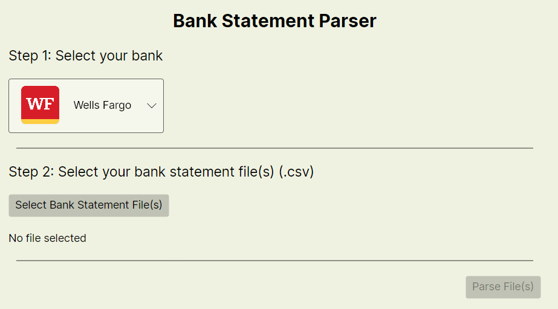
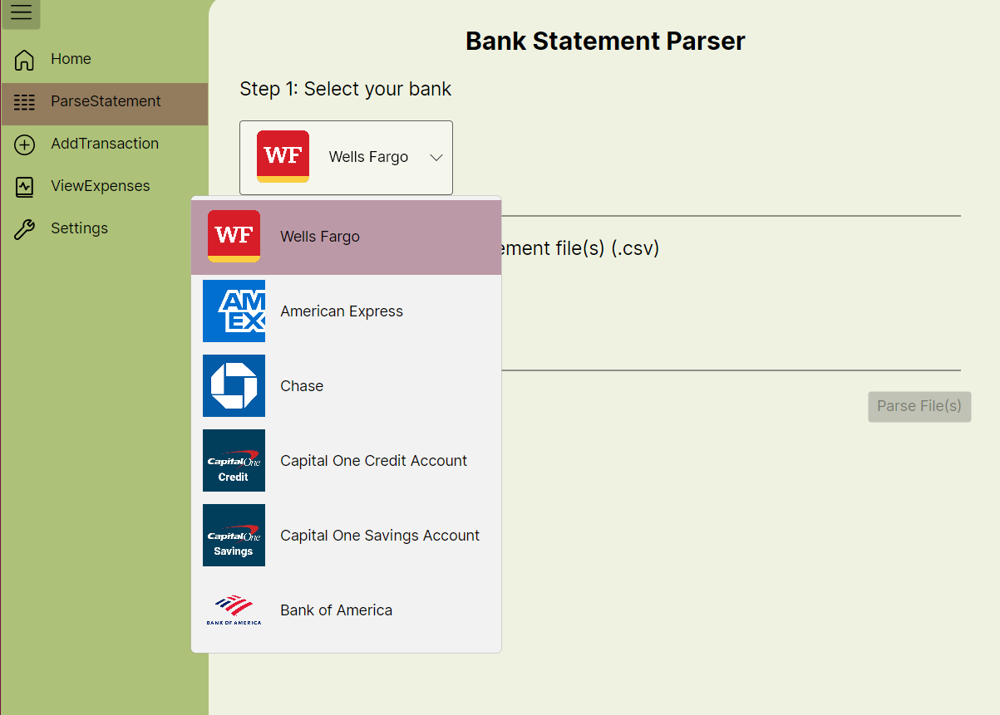
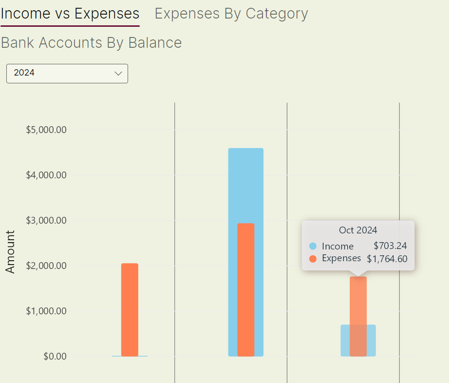
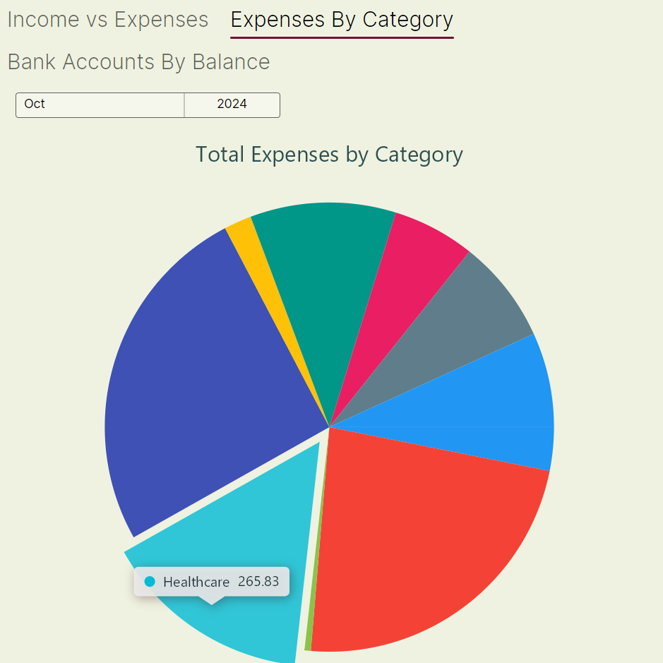
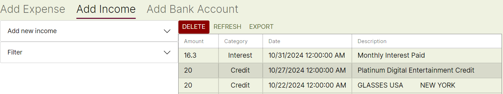
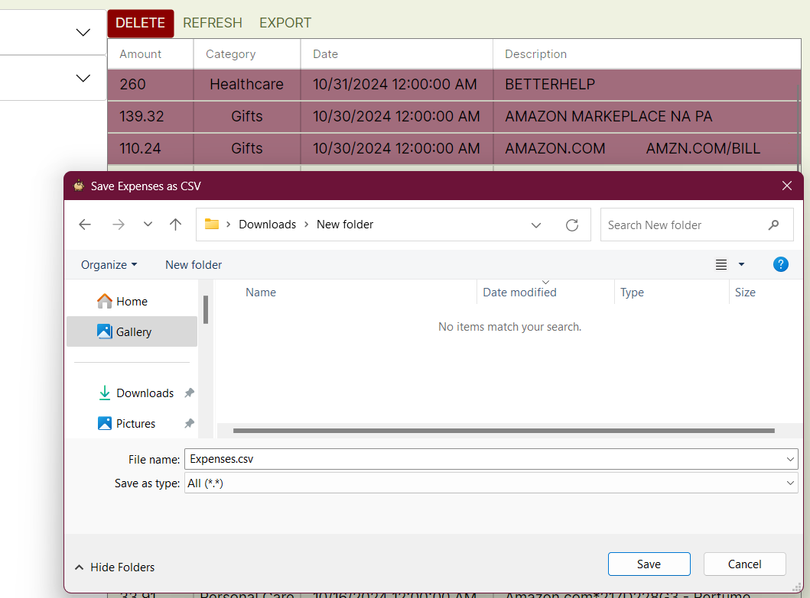

# BalanceBuddyDesktop

BalanceBuddyDesktop is a financial management application that helps users manage their expenses, incomes, and bank accounts with ease. 
It's built using Avalonia and C# for cross-platform functionality, along with the MVVM (Model-View-ViewModel) design pattern.
## Features
### Auto-parse your bank statements - just feed a CSV of your statement to the app.



### Visualize trends - view trends in spending and income



### Maintain a spreadsheet of your transactions


### Export selected transactions to CSVs


## Technologies Used

C# & .NET: Core technology used for building the application.

Avalonia: For building the cross platform UI.

MVVM Pattern: Used to separate the application's UI from its logic, making the app modular and testable.

## Installation

### Clone the Repository:

```bash 
git clone https://github.com/username/BalanceBuddyDesktop.git
```

### Navigate to the Project Directory:

```bash 
cd BalanceBuddyDesktop
```

### Build the Project:
Open the project in Visual Studio or another IDE that supports .NET projects and build the solution.

### Run the Application:
Press F5 or use the Run command from your IDE.
